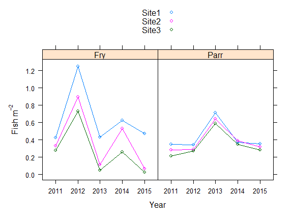

Modelling Capture Probability
================
26 August 2020

[](https://travis-ci.org/Faskally/ef)

## installation

To instal the TMB version `ef` package run

``` r
remotes::install_github("faskally/ef@tmb")
```

# Create Required Fields for Analysis

Create a factor for pass with separate levels for the first and
subsequent passes. NOTE: Assuming the second and third pass have the
same capture probability avoids problems with model identifiability
([Millar *et al*.,
2016](https://www.sciencedirect.com/science/article/pii/S0165783616300017))

``` r
ef_data$pass12 <- factor(replace(ef_data$pass, ef_data$pass > 2, 2))
```

Create a sampleID for grouping EF counts together. A sample is a unique
combination of site visit x species x lifestage and is required by the
EF function

``` r
ef_data$sampleID <-
  as.numeric(
    factor(
      paste(ef_data$date, ef_data$siteID, ef_data$lifestage, ef_data$species)
    )
  )
```

Create a visitID for unique site visits. This is required by the
overdispersion function (see below).

``` r
ef_data$visitID <- factor(paste(ef_data$date, ef_data$siteID))
```

# Fit a Model

Fit a simple model. This contains a factor for pass (2 levels),
lifestage (2 levels), site (3 levels) and year (5 levels). With a larger
dataset it would also be possible to add continuous variables as linear
or smoothed terms providing the degrees of freedom are specified
(typically up to k=3 (2 d.f.), see [Millar *et al*.,
2016](https://www.sciencedirect.com/science/article/pii/S0165783616300017)
for further details)

``` r
m1 <-
  efp(
    count ~ pass12 + lifestage + siteID + year,
    data = ef_data, pass = pass, id = sampleID
  )
```

    ## 
    ## Call:  efp(formula = count ~ pass12 + lifestage + siteID + year, data = ef_data, 
    ##     pass = pass, id = sampleID)
    ## 
    ## Coefficients:
    ##   (Intercept)        pass122  lifestageParr    siteIDSite2    siteIDSite3       year2012       year2013       year2014  
    ##       0.65231       -0.23915        0.59065        0.07453       -0.02373       -0.20996        0.04698        0.35844  
    ##      year2015  
    ##      -0.00402  
    ## 
    ## Degrees of Freedom: 90 Total (i.e. Null);  81 Residual
    ## Null Deviance:       NA 
    ## Residual Deviance: NA    AIC: 3188

# Get Predicted Values for *P*

The model needs to be reformatted to allow predictions (i.e. obtain *P*)
capture probabilities, uses as.gam function.

``` r
m1_gam <- as.gam(m1)
```

Predict *P* from the model to the full dataset. Note, if all the data is
multi-pass then can just use fitted values. However, if you want P for
both single and multi-pass data then predict to the new dataframe

``` r
ef_data$prob <- predict.gam(m1_gam, newdata=ef_data, type = "response")
```

# Obtain Cumulative Estimates of *P* (for estimation of densities later)

Aggregate counts by sampleID (i.e. counts of fry or parr per site visit)

``` r
counts <- aggregate(count ~ sampleID, ef_data, sum)
```

Reshape to get capture probability by species x lifestage x site visit x
pass. This facilitates the summary of *P*.

``` r
probs <- cast(ef_data, sampleID ~ pass)
```

Get cumulative capture probability by sampleID (see [Glover *et al*.,
2018](https://www.sciencedirect.com/science/article/pii/S1470160X18303534))

``` r
probs $ prob <- apply(probs[,2:4], 1, function(x) 1 - prod(1-x))
```

Remove individual pass capture probabilities

``` r
probs <- select(probs, sampleID, prob)
```

Remove pass and pass-specific data from dataframe

``` r
densdata <- unique(select(ef_data, -count, -prob, -pass, -pass12))
```

Join data and cumulative counts by sampleID

``` r
densdata <- left_join(densdata, counts, by = "sampleID")
```

Join data and cumulative capture probability by sampleID

``` r
densdata <- left_join(densdata, probs, by = "sampleID")
```

# Estimate Density

Density (N/m<sup>-2</sup>) is estimated as \(\frac{counts}{area*P}\)

``` r
densdata $ Density_Estimate <- densdata $ count / (densdata $ area *
                                                      densdata $ prob)
```

If you want to model counts directly (Poisson model), you need to have
cumulative P and area in the offset. For a Poisson model the offset is
\(\log({area*cumulativeP})\).

``` r
densdata $ offset <- log(densdata $ area * densdata $ prob)
```

Plot to check

<!-- -->

# Comparing Models

Because electrofishing count data are typically overdispersed and
because the modelling framework cannot incorpororate random effects, it
it necessary to estimate the amount of overdispersion in the data and to
account for this when comparing models.

Overdispersion is estimated by fitting a large model that captures most
of the systematic variation in the data and comparing this to a
visit-wise and saturated model (see [Millar *et al*.,
2016](https://www.sciencedirect.com/science/article/pii/S0165783616300017)):

``` r
large_model <- efp(count ~ pass12 + lifestage + siteID + year,
                   data = ef_data, pass = pass, id = sampleID)
```

Use the overdispersion function in the ef package and specify the data,
visit ID, site ID, sample ID and the large model.

``` r
od_estimate <- overdispersion(data = ef_data, visitID = "visitID",
                              siteID = "siteID", id = "sampleID",
                              largemodel = large_model)
```

View overdispersion estimate. The ‘disp’ column contains the estimates
of overdispersion and the 3rd row contains the between-visit estimate
that is used to adjust the BIC.

``` r
od_estimate
```

Compare models using the adjusted BIC function (Equation 4, [Millar *et
al*.,
2016](https://www.sciencedirect.com/science/article/pii/S0165783616300017))

  - Full model

<!-- end list -->

``` r
mfull <- efp(count ~ pass12 + lifestage + siteID + year,
             data = ef_data, pass = pass, id = sampleID)

BICadj(mfull, ef_data, od_estimate)
```

  - Model without lifestage

<!-- end list -->

``` r
mlife <- efp(count ~ pass12 + siteID + year,
             data = ef_data, pass = pass, id = sampleID)

BICadj(mlife, ef_data, od_estimate)
```

### how to build this file

this file was created using

``` r
rmarkdown::render("README.Rmd")
```
